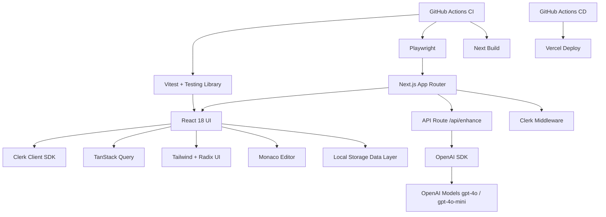

# Zeus Website

Zeus Website is a Next.js App Router application that combines a marketing surface, authenticated user flows, and an AI-assisted text editor. The project is designed for iterative product delivery with modern frontend tooling, test automation, and CI/CD workflows.

## Table of Contents

- [Project Overview](#project-overview)
- [Tech Stack](#tech-stack)
- [Dependencies and Requirements](#dependencies-and-requirements)
- [Project Structure](#project-structure)
- [Architecture Summary](#architecture-summary)
- [Automation and DevOps](#automation-and-devops)
- [Setup and Local Development](#setup-and-local-development)
- [Usage Examples](#usage-examples)
- [Deployment Options and Scalability Notes](#deployment-options-and-scalability-notes)
- [Security Considerations](#security-considerations)
- [Contributing Guidelines](#contributing-guidelines)
- [Contribution Roadmap](#contribution-roadmap)
- [License and Attribution](#license-and-attribution)

## Project Overview

Zeus provides two primary value streams:

1. A conversion-oriented marketing site for the Zeus ecosystem and Chrome extension distribution.
2. A writing and prompt enhancement experience where users can analyze and improve text with OpenAI-backed processing.

Key product features:

- Clerk-based authentication, route protection, and account-aware pages.
- AI text analysis and enhancement with multiple enhancement modes.
- API proxy pattern (`app/api/enhance/route.ts`) for server-mediated OpenAI operations.
- Local persistence of editor artifacts through `localStorage` data abstractions.
- Test automation across unit and browser-level e2e flows.

Unique value proposition:

- The system supports server-proxy-first AI calls while preserving a compatibility fallback path for browser-side key usage during transition periods. This enables gradual hardening without abrupt user impact.

## Tech Stack

### Languages and Runtime

- TypeScript
- JavaScript (tooling/runtime scripts)
- Node.js 20 (CI target runtime)

### Frameworks and Core Libraries

- Next.js 15 (App Router)
- React 18
- Clerk (`@clerk/nextjs`) for auth and middleware protection
- OpenAI SDK (`openai`) for text model interaction
- TanStack Query for client-side data coordination

### UI and Design System

- Tailwind CSS
- Radix UI primitives (accordion, dialog, menu, tabs, and related packages)
- `next-themes` for theme switching
- `lucide-react` icon system
- `sonner` and shadcn-style UI composition under `src/components/ui`

### Form, Validation, and Editor Tooling

- `react-hook-form`
- `zod` and `@hookform/resolvers`
- Monaco Editor (`@monaco-editor/react`, `monaco-editor`)

### Quality and Developer Tooling

- ESLint
- Vitest (`vitest`, `@vitest/ui`, `@vitest/coverage-v8`)
- Testing Library (`@testing-library/react`, `@testing-library/jest-dom`, `@testing-library/user-event`)
- Playwright (`@playwright/test`)

## Dependencies and Requirements

### System Requirements

- Node.js 20 or newer recommended.
- npm for automation and CI parity.
- A modern browser for local verification.

### Third-Party Services

- Clerk account and keys for authentication-enabled flows.
- OpenAI API access for enhancement and analysis features.
- Optional Vercel account/token for CD deployment.

### Environment Variables

Defined in `.env.example`:

| Variable | Required | Purpose |
| --- | --- | --- |
| `NEXT_PUBLIC_CLERK_PUBLISHABLE_KEY` | Yes (for auth) | Clerk publishable key used by client auth components |
| `CLERK_SECRET_KEY` | Yes (for auth) | Clerk server key for middleware and server-side auth |
| `OPENAI_API_KEY` | Recommended | Server-side key for `/api/enhance` proxy strict mode |
| `NEXT_PUBLIC_OPENAI_SERVER_PROXY` | Optional | `true` by default; set `false` to force legacy browser path |
| `NEXT_PUBLIC_OPENAI_STRICT_SERVER_ONLY` | Optional | When `true`, blocks browser fallback and enforces proxy-only behavior |

### Dependency Diagram



## Project Structure

High-level structure and ownership boundaries:

```text
.
├─ app/                        # Next.js App Router entrypoints and API routes
│  ├─ api/enhance/route.ts     # OpenAI proxy endpoint (analyze/enhance/complete)
│  ├─ about/page.tsx
│  ├─ contact/page.tsx
│  ├─ dashboard/page.tsx
│  ├─ editor/page.tsx
│  ├─ signin/page.tsx
│  ├─ signup/page.tsx
│  ├─ layout.tsx
│  └─ page.tsx
├─ src/
│  ├─ components/              # Shared UI and feature components
│  ├─ lib/
│  │  ├─ openai.ts             # Proxy-first OpenAI client wrapper with fallback logic
│  │  ├─ database.ts           # localStorage-backed data abstraction
│  │  └─ utils.ts
│  ├─ routes/                  # Feature route components mounted by app pages
│  └─ tests/
│     ├─ setup.ts              # Unit test setup and environment mocks
│     └─ unit/utils.test.ts
├─ tests/e2e/homepage.spec.ts  # Playwright smoke test
├─ middleware.ts               # Clerk route protection and public route matcher
├─ .github/workflows/
│  ├─ ci.yml                   # Lint/test/build/e2e automation
│  └─ cd.yml                   # Optional Vercel deployment
├─ vitest.config.ts
├─ playwright.config.ts
└─ README.md
```

## Architecture Summary

- Routing model: Next.js App Router with route-level files under `app/`.
- Auth model: Clerk provider in root layout with middleware enforcement and public-route exemptions.
- AI model access: Proxy-first through `app/api/enhance/route.ts`, with optional fallback path in `src/lib/openai.ts`.
- Persistence model: Browser `localStorage` through typed helper methods (`src/lib/database.ts`).
- UI model: Componentized React + Radix primitives + Tailwind-driven styling.

The `/api/enhance` endpoint supports these actions:

- `analyze`
- `enhance`
- `complete`
- `validate`
- `config`

This supports both API key validation and runtime feature negotiation for strict server mode.

## Automation and DevOps

### CI Pipeline

`/.github/workflows/ci.yml` executes on:

- `push` to `main` and `develop`
- all pull requests

CI stages:

1. Checkout
2. Node.js 20 setup with npm cache
3. `npm ci`
4. `npm run lint`
5. `npm run test:unit`
6. `npm run build`
7. Playwright browser install
8. `npm run test:e2e`

CI also injects dummy Clerk keys so auth-dependent pages do not fail build/test due to missing secrets.

### CD Pipeline

`/.github/workflows/cd.yml` executes on push to `main` and deploys to Vercel when secrets are available:

- `VERCEL_TOKEN`
- `VERCEL_ORG_ID`
- `VERCEL_PROJECT_ID`

Deployment is safely skipped when required Vercel secrets are not configured.

## Setup and Local Development

### 1. Install Dependencies

```bash
npm install
```

### 2. Configure Environment

Create `.env` or `.env.local` using `.env.example`:

```env
NEXT_PUBLIC_CLERK_PUBLISHABLE_KEY=pk_test_example
CLERK_SECRET_KEY=sk_test_example
OPENAI_API_KEY=
NEXT_PUBLIC_OPENAI_SERVER_PROXY=true
NEXT_PUBLIC_OPENAI_STRICT_SERVER_ONLY=false
```

### 3. Start the Development Server

```bash
npm run dev
```

Default URL:

```text
http://localhost:8080
```

### 4. Verify Quality Gates Locally

```bash
npm run lint
npm run test:unit
npm run test:e2e
npm run build
```

## Usage Examples

### Run Full Test Stack

```bash
npm run test:all
```

Expected output pattern:

```text
> npm run test:unit && npm run test:e2e
... unit tests passed ...
... 1 passed (Playwright e2e) ...
```

### Call Enhance API (analyze action)

```bash
curl -X POST http://localhost:8080/api/enhance \
  -H "Content-Type: application/json" \
  -H "x-openai-key: sk-your-key" \
  -d '{
    "action": "analyze",
    "text": "This are an example sentence with grammar issue."
  }'
```

### Call Enhance API (enhance action)

```bash
curl -X POST http://localhost:8080/api/enhance \
  -H "Content-Type: application/json" \
  -H "x-openai-key: sk-your-key" \
  -d '{
    "action": "enhance",
    "text": "Please improve this note for a client update.",
    "options": {
      "type": "professional",
      "preserveFormatting": true
    }
  }'
```

### Check Proxy Configuration Mode

```bash
curl -X POST http://localhost:8080/api/enhance \
  -H "Content-Type: application/json" \
  -d '{"action":"config"}'
```

## Deployment Options and Scalability Notes

### Option 1: GitHub Actions CD to Vercel

- Recommended for teams already using Vercel.
- Uses `cd.yml` with secret-gated deployment.
- Production deploy command: `npx vercel --prod --yes --token "$VERCEL_TOKEN"`.

### Option 2: Self-Hosted Node Runtime

```bash
npm ci
npm run build
npm run start
```

This serves the standalone Next.js server and binds to the platform-provided `PORT` (defaults to 3000 when `PORT` is unset).

### Option 3: GitHub Actions CD to Azure App Service

- Uses `.github/workflows/azure-app-service.yml`.
- Builds Next.js in standalone mode and deploys only the runtime artifact.
- Designed for the same single-repo workflow used by Vercel.

Required GitHub repository secrets:

- `AZURE_WEBAPP_NAME` (your Azure Web App name)
- `AZURE_WEBAPP_PUBLISH_PROFILE` (download publish profile XML from Azure portal)

Recommended Azure App Settings:

- `NODE_ENV=production`
- `NEXT_PUBLIC_CLERK_PUBLISHABLE_KEY=<your value>`
- `CLERK_SECRET_KEY=<your value>`
- `OPENAI_API_KEY=<your value if using server-side proxy mode>`
- `NEXT_PUBLIC_OPENAI_SERVER_PROXY=true`
- `NEXT_PUBLIC_OPENAI_STRICT_SERVER_ONLY=false` (or `true` for strict server-only mode)

### Scalability Notes

- Current localStorage persistence does not support multi-device sync; migrate to a managed datastore for horizontal scale.
- Move fully to strict server-only OpenAI mode for centralized key management and observability.
- Introduce API rate limits and request tracing for production-grade AI traffic control.
- Expand e2e coverage from smoke testing to authenticated and editor workflows.

## Security Considerations

- Prefer `OPENAI_API_KEY` on server and `NEXT_PUBLIC_OPENAI_STRICT_SERVER_ONLY=true` for hardened deployments.
- Avoid long-term reliance on client-side key headers (`x-openai-key`) in public contexts.
- Keep Clerk secret keys only in server-side environments and CI secrets.
- Consider adding request validation and abuse protection on `/api/enhance` before high-volume deployment.

## Contributing Guidelines

### Code Style and Standards

- Use TypeScript-first changes for app logic.
- Preserve existing import alias conventions (`@/`).
- Keep changes small, reviewable, and scoped to a single concern.
- Run lint, unit tests, and build before opening PR.

### Issue Reporting Protocol

When opening an issue, include:

1. Environment details (OS, Node version, package manager).
2. Reproduction steps.
3. Expected vs actual behavior.
4. Logs or screenshots when relevant.

### Pull Request Protocol

1. Create a feature branch from `main`.
2. Add or update tests for behavior changes.
3. Update docs when implementation details change.
4. Ensure CI passes (`lint`, `test:unit`, `build`, `test:e2e`).
5. Use clear PR titles and include risk/rollback notes for non-trivial changes.

## Contribution Roadmap

Major features recommended for upcoming releases:

1. Replace localStorage persistence with server-backed storage and user-scoped records.
2. Expand `/api/enhance` with auth-aware quotas and structured telemetry.
3. Add multi-step e2e coverage: sign-in, editor save flow, enhancement flow.
4. Integrate richer dashboard analytics from persisted writing/session metrics.
5. Improve frontend performance by migrating remaining `` usage to optimized image handling.
6. Add role-based admin controls for moderation and operational monitoring.

## License and Attribution

This project is licensed under the MIT License.

See the `LICENSE` file in the repository root for the full legal text.

MIT attribution requirements:

- Include the full MIT license text in the `LICENSE` file.
- Preserve copyright and permission notice in substantial source distributions.
- Document third-party notices when required by dependency licenses.
